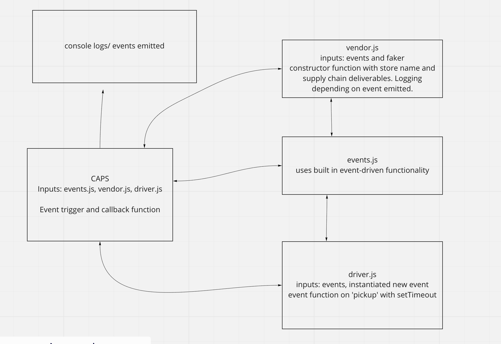

# CAPS application
I created the start of an application that emulates a real world supply chain. The app simulates delivery service where vendors will ship products using my delivery service and when driver deliver them, customers will be notified up packages that are picked up, in-transit, and delivered with event driven functionality. 

## Author
Nick Abramowicz

## Github Pull Request(s)
- https://github.com/nickdeans/caps/pull/1
- https://github.com/nickdeans/caps/pull/2

## UML 
